[](https://paperswithcode.com/sota/zero-shot-object-detection-on-ms-coco?p=synthesizing-the-unseen-for-zero-shot-object)

[](https://paperswithcode.com/sota/generalized-zero-shot-object-detection-on-ms?p=synthesizing-the-unseen-for-zero-shot-object)

[](https://paperswithcode.com/sota/zero-shot-object-detection-on-pascal-voc-07?p=synthesizing-the-unseen-for-zero-shot-object)

[](https://paperswithcode.com/sota/zero-shot-object-detection-on-imagenet?p=synthesizing-the-unseen-for-zero-shot-object)

## Code for [ACCV 2020](https://openaccess.thecvf.com/content/ACCV2020/papers/Hayat_Synthesizing_the_Unseen_for_Zero-shot_Object_Detection_ACCV_2020_paper.pdf)  Synthesizing the Unseen for Zero-shot Object Detection

Zero Shot Detection (ZSD) is a recently introduced paradigm which enables simultaneous localization and classification of previously unseen objects. It is arguably the most extreme case of learning with minimal supervision. we propose a symantically driven conditional feature generation module to synthesize visual features for unseen objects. 

### Feature Generation Pipeline

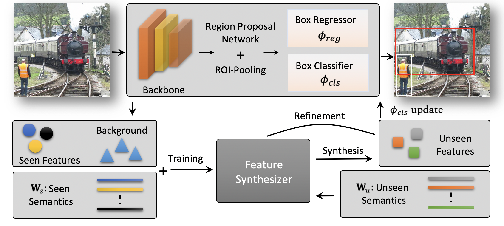

### Feature Synthesizer

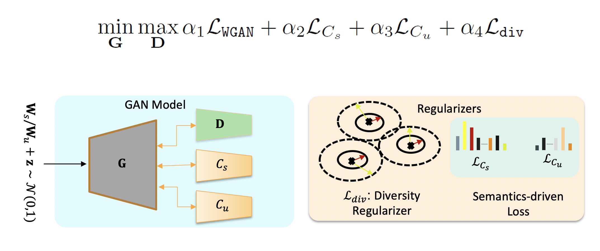


### t-SNE Visualization

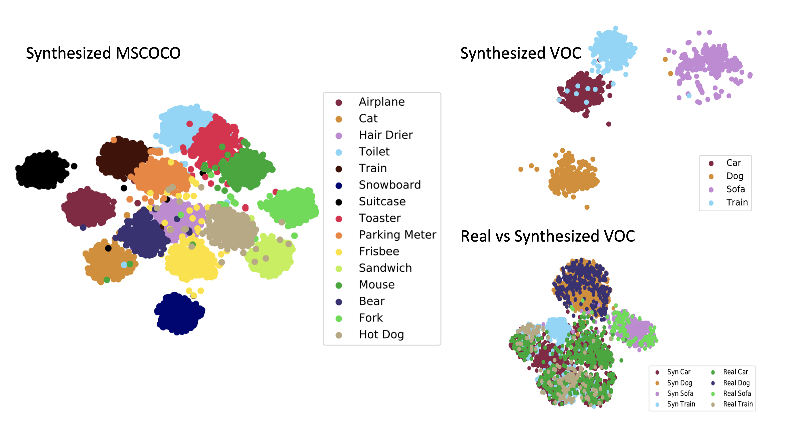

### Set up the environment
- [mmdetection](https://github.com/open-mmlab/mmdetection) we recommend using [Docker 2.0](Docker.md). Please use the mmdetection codes from this repo. 
- conda env create -f environment.yml


The following scripts are for dfferents steps in the pipeline on MSCOCO dataset, please see the respective files for more arguments. 
Before running the scripts, please set the datasets and backbone paths in the config files. Weights of [ResNet101](https://drive.google.com/file/d/1g3UXPw-_K3na7acQGZlhjgQPjXz_FNnX/view?usp=sharing) trained excluding overlapping unseen classes from ImageNet.
Weights of FasterRCNN trained on [MSCOCO2014](https://drive.google.com/drive/folders/1FMJWIT4yZ-kTD7KLarQ6SDJff8STWIqB?usp=sharing), [PASCALVOC](https://drive.google.com/file/d/1Y4l0Qf7xPYXXtdgfTU3YCzcRVnZySf6q/view?usp=sharing), [ILSVRC](https://drive.google.com/file/d/19a9mkfL1B1N5YqI3EkGMP_ipl7JyY4Kc/view?usp=sharing)

### 1. Train Detector

    cd mmdetection
    ./tools/dist_train.sh configs/faster_rcnn_r101_fpn_1x.py 8 --validate


### 2. extract features

<!-- The exmaple script is for MSCOCO please see the mmdetection/tools/zero_shot_utils.py for more arguments. -->

    cd mmdetection
    # extract seen classes features to train Synthesizer and unseen class features for cross validation
    python tools/zero_shot_utils.py configs/faster_rcnn_r101_fpn_1x.py --classes [seen, unseen] --load_from [detector checkpoint path] --save_dir [path to save features] --data_split [train, test]

    # example to extract training features for seen classes

    python tools/zero_shot_utils.py configs/faster_rcnn_r101_fpn_1x.py --classes seen --load_from ./work_dir/coco2014/epoch_12.pth --save_dir ../../data/coco --data_split train

    # example to extract test features for unseen classes
    
    python tools/zero_shot_utils.py configs/faster_rcnn_r101_fpn_1x.py --classes unseen --load_from ./work_dir/coco2014/epoch_12.pth --save_dir ../../data/coco --data_split test


### 3. Train Generator
    # modify the paths to extracted features, labels and model checkpoints. 
    ./script/train_coco_generator_65_15.sh

### 4. Evaluate

    cd mmdetection
        ./tools/dist_test.sh configs/faster_rcnn_r101_fpn_1x.py [detector checkpoint path for seen classes] [num of gpus] --dataset [coco, voc, imagenet] --out [file name to save detection results] [--zsd, --gzsd] --syn_weights [path to synthesized classifier checkpoint]

    # example 
    
    ./tools/dist_test.sh configs/faster_rcnn_r101_fpn_1x.py work_dir/coco2014/epoch_12.pth 8 --dataset coco --out coco_results.pkl --zsd --syn_weights ../checkpoints/coco_65_15/classifier_best_137.pth
    
### Citation 
If you use this code for your research, please consider citing:

```
    @misc{hayat2020synthesizing,
      title={Synthesizing the Unseen for Zero-shot Object Detection}, 
      author={Nasir Hayat and Munawar Hayat and Shafin Rahman and Salman Khan and Syed Waqas Zamir and Fahad Shahbaz Khan},
      year={2020},
      eprint={2010.09425},
      archivePrefix={arXiv},
      primaryClass={cs.CV}
    }
```
### Results
- MSCOCO 

    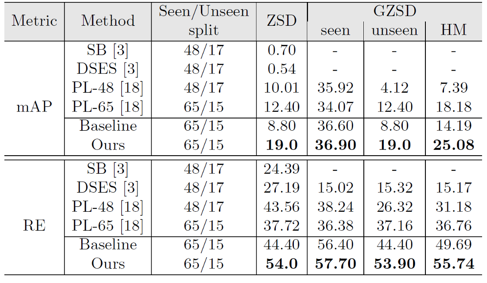

- MSCOCO Class Wise AP

    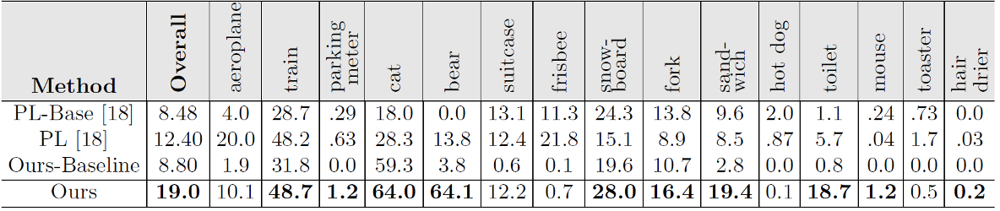

- ILSVRC

    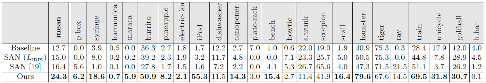

- PASCAL VOC

    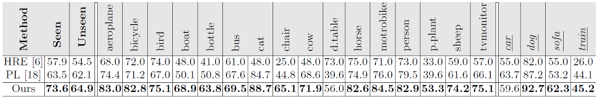

### Qualitative Results

- Zero Shot Detections

    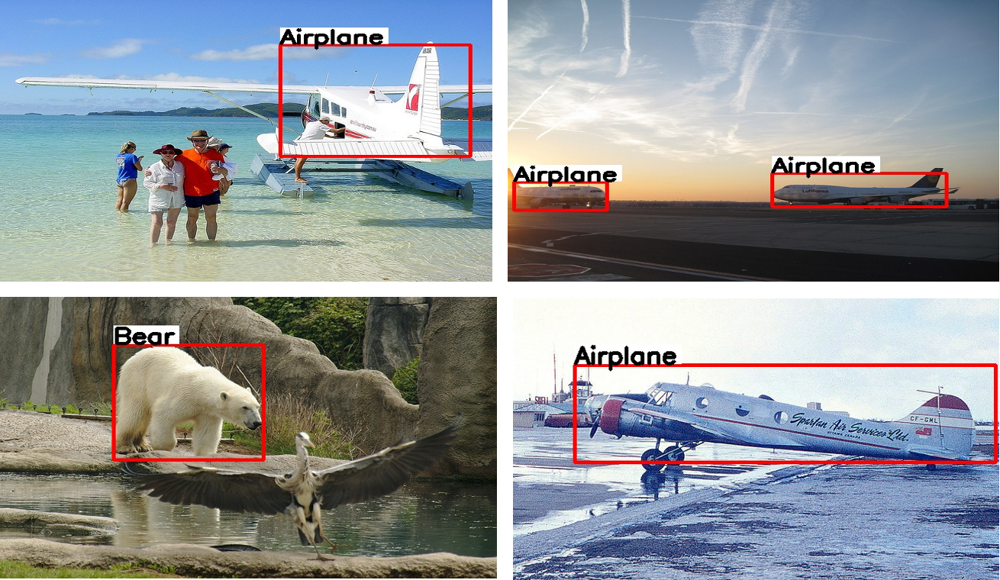 
    
    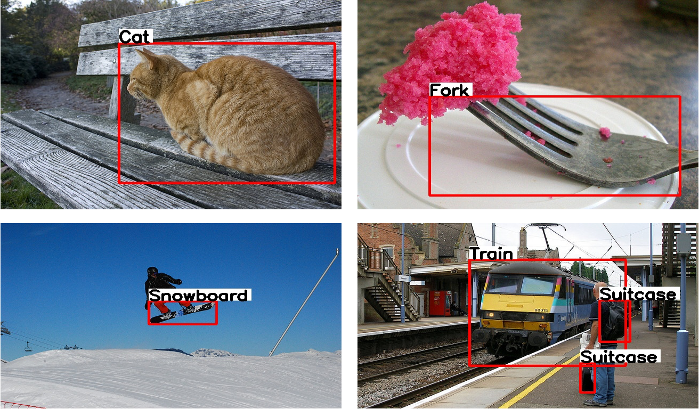

- Generalized Zero Shot Detections 

    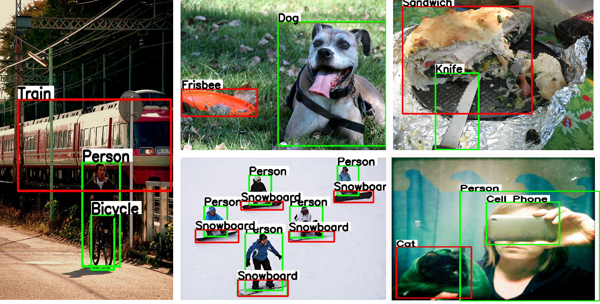

    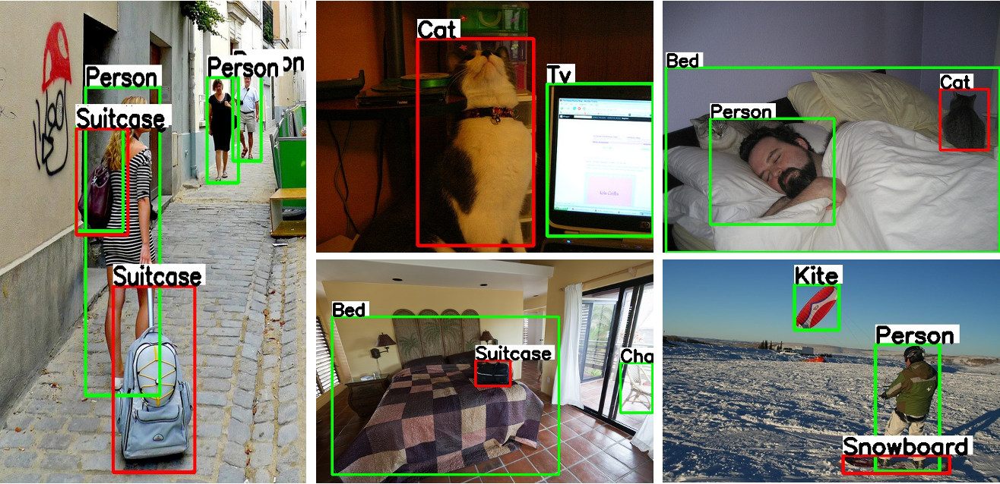


<!-- conda install -c conda-forge scikit-build -->
<!-- conda install -c conda-forge imgaug -->

